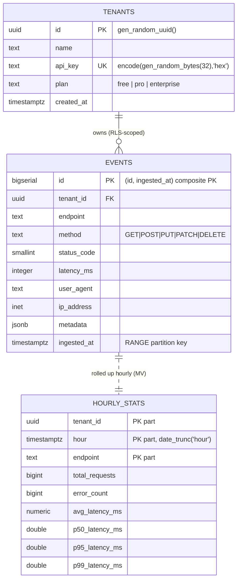

# ERD — PgPulse



## Partitioning layout

`events` is the partitioned parent; physical rows live in monthly children:

```
events (PARTITION BY RANGE (ingested_at))
├── events_2026_05   FROM ('2026-05-01') TO ('2026-06-01')
├── events_2026_06   FROM ('2026-06-01') TO ('2026-07-01')   <- current (hot)
├── events_2026_07   FROM ('2026-07-01') TO ('2026-08-01')
├── events_2026_08   FROM ('2026-08-01') TO ('2026-09-01')
└── events_default   (catch-all; should normally stay empty)
```

Indexes, RLS policies, and the FK are declared on the parent and inherited by
every current and future child partition.
